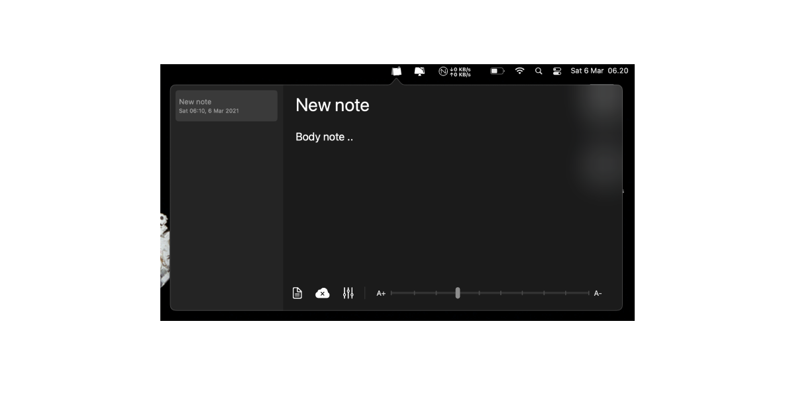
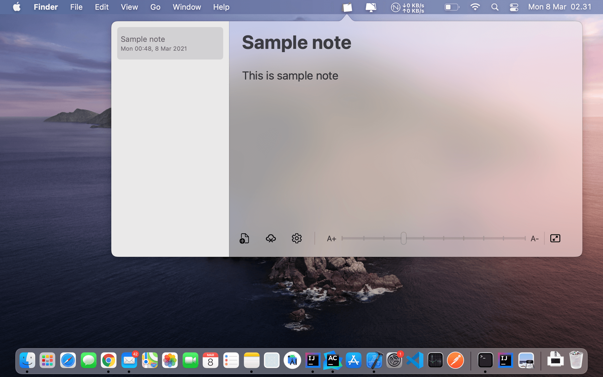

<p align="center">
  <h1 align="center">notatod</h1>
</p>

<p align="center">
  
</p>

<p align="center">
  <a href="#"></a>
  <a href="LICENSE"></a>
  <a href="https://github.com/utsmannn/notatod/pulls"></a>
  <a href="https://twitter.com/utsmannn"></a>
  <a href="https://github.com/utsmannn"></a>
  <p align="center">Simple note application popover on your MacOS<br>Run in menubar and build with SwiftUI</p>
</p>

|dark theme|light theme|
|---|---|
|||

## Download
Go to [release page](https://github.com/utsmannn/notatod/releases)
```
Version 1.1.0-alpha-2 (latest version)
- Add backward compability until Catalina
- Add resize popover window
- Enable google drive sync (internal tester)
- Change icon to Fluent Icon by Microsoft
- Add about page
- Fix updater API

Version 1.0.0-alpha-1
- First release with DMG installer
```

- [Privacy Policy](https://utsmannn.github.io/notatod/privacy-policy)
- [Terms & Conditions](https://utsmannn.github.io/notatod/terms-and-conditions)

## Feature
- [x] Simple editor
- [x] Font size customizable
- [x] Preferences menu
- [x] Simple ui
- [x] Synchronized with Google Drive (internal testing)

## Roadmap
- [ ] Keyboard shortcut
- [ ] Enable launch at login
- [ ] Image inserting
- [ ] Markdown support
- [ ] Mobile client support

## Build with
- SwiftUI
- Xcode + AppCode
- Kotlin Ktor updater API

## License
```
Copyright 2021 Muhammad Utsman

Licensed under the Apache License, Version 2.0 (the "License");
you may not use this file except in compliance with the License.
You may obtain a copy of the License at

    http://www.apache.org/licenses/LICENSE-2.0

Unless required by applicable law or agreed to in writing, software
distributed under the License is distributed on an "AS IS" BASIS,
WITHOUT WARRANTIES OR CONDITIONS OF ANY KIND, either express or implied.
See the License for the specific language governing permissions and
limitations under the License.
```