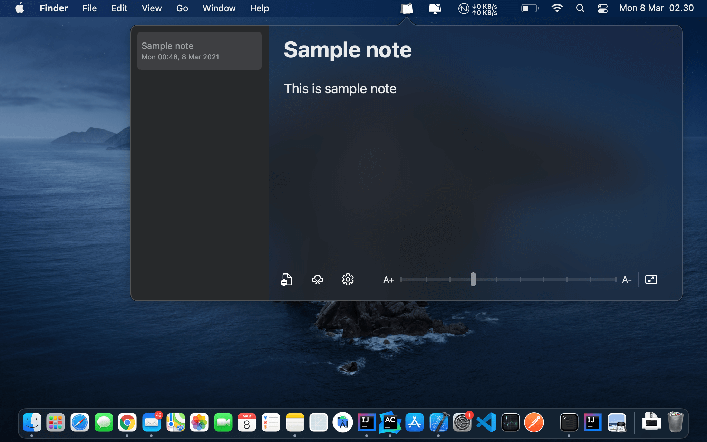
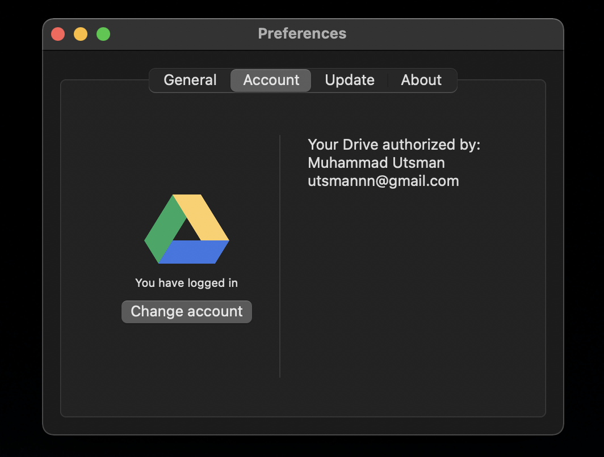
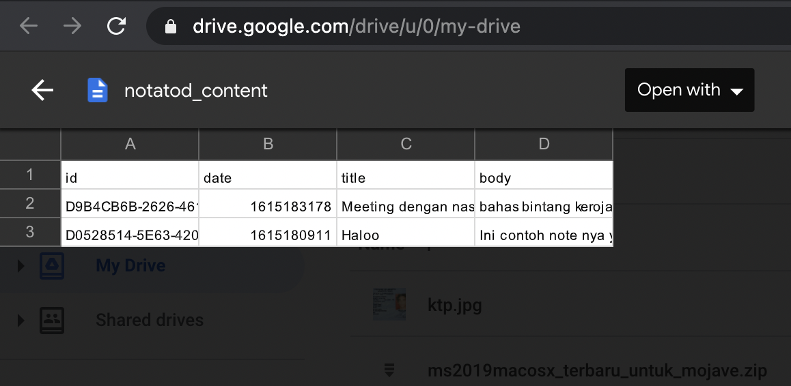

<div align="center">
  

  <h1 align="center">notatod</h1>
</div>

<p align="center">
  
</p>

<p align="center">
  <a href="#"></a>
  <a href="LICENSE"></a>
  <a href="https://github.com/utsmannn/notatod/pulls"></a>
  <a href="https://twitter.com/utsmannn"></a>
  <a href="https://github.com/utsmannn"></a>
  <p align="center">Simple note application popover on your MacOS<br>Run in menubar and build with SwiftUI</p>
</p>

|dark theme|light theme|
|---|---|
|||

|drive account connected|note file in drive|
|---|---|
|||

## Compatibility
- This app work with 10.15 (Catalina) or later
- Work with Intel arch x86_64
- Work with Apple Silicon M1

## Download
Go to [release page](https://github.com/utsmannn/notatod/releases) and download *.dmg asset of the latest release
```
Version 1.1.0-alpha-4 (latest version)
- Add Dropbox Integration
- Add new route (/v1) for feature update api
- Fix editor in High Sierra

Version 1.1.0-alpha-3
- Add keyboard shortcut
- Add window when app open
- Add Google OAuth2 performance

Version 1.1.0-alpha-2
- Add backward compability until Catalina
- Add resize popover window
- Enable google drive sync (internal tester)
- Change icon to Fluent Icon by Microsoft
- Add about page
- Fix updater API

Version 1.0.0-alpha-1
- First release with DMG installer
```

- [Privacy Policy](https://utsmannn.github.io/notatod/privacy-policy)
- [Terms & Conditions](https://utsmannn.github.io/notatod/terms-and-conditions)

## Feature
- [x] Simple editor
- [x] Font size customizable
- [x] Preferences menu
- [x] Simple ui
- [x] Synchronized with Google Drive (internal testing)
- [x] Add Dropbox API for Google Drive API alternative
- [x] Keyboard shortcut

## Roadmap
- [ ] Signing code and validate app for macos
- [ ] Enable launch at login
- [ ] Image inserting
- [ ] Code highlighter
- [ ] Mobile client support

## Build with
- Swift
- SwiftUI
- AppCode + XCode
- MVVM Clean Arch
- Google Drive API (REST)
- Dropbox API (REST)
- KeyboardShortcuts (by [Sindre Sorhus](https://github.com/sindresorhus/KeyboardShortcuts))
- Kotlin Ktor for updater API

## License
```
Copyright 2021 Muhammad Utsman

Licensed under the Apache License, Version 2.0 (the "License");
you may not use this file except in compliance with the License.
You may obtain a copy of the License at

    http://www.apache.org/licenses/LICENSE-2.0

Unless required by applicable law or agreed to in writing, software
distributed under the License is distributed on an "AS IS" BASIS,
WITHOUT WARRANTIES OR CONDITIONS OF ANY KIND, either express or implied.
See the License for the specific language governing permissions and
limitations under the License.
```
